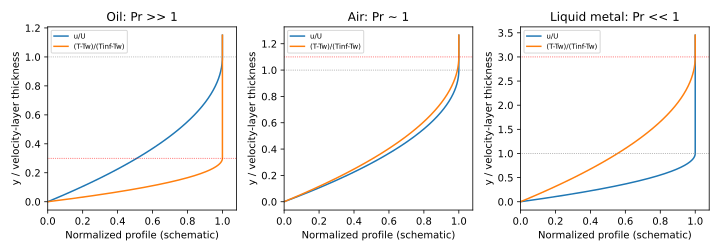

# 习题 5-2：速度与温度边界层

Pr=ν/a 比较动量扩散与热扩散速度。同一无滑移壁面上，速度从零增至主流速度；温度从壁温趋近主流温度。

| 流体 | Pr | 温度层与速度层 |
|---|---|---|
| 润滑油 | 远大于1 | 热扩散慢，δ_t远小于δ |
| 空气 | 约0.7 | 两层厚度相近，温度层稍厚 |
| 液态金属 | 远小于1 | 热扩散快，δ_t远大于δ |

对常用层流平板关联式的适用 Pr 范围，δ_t/δ≈Pr^(-1/3)。液态金属的极低 Pr 不宜直接套用该近似作精确计算。

