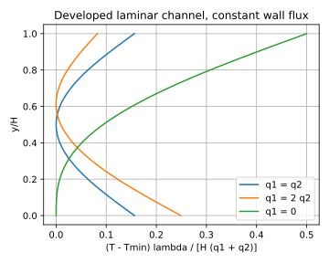

# 习题 5-3：平行板充分发展温度分布

设下壁 y=0、上壁 y=H，q₁、q₂均以向流体供热为正。恒物性、充分发展的层流速度为 u=6Uη(1−η)，η=y/H。单位宽度能量平衡给出：

$$\rho c_p UH\frac{dT_b}{dx}=q_1+q_2.$$

忽略轴向导热，代入能量方程并使用下壁条件 −λ∂T/∂y=q₁：

$$\lambda\frac{\partial T}{\partial y}=-q_1+(q_1+q_2)(3\eta^2-2\eta^3),$$
$$T(x,y)-T(x,0)=\frac H\lambda[-q_1\eta+(q_1+q_2)(\eta^3-\tfrac12\eta^4)].$$

两壁等热流时温度分布关于中面对称，最低温在 η=1/2。q₁=2q₂时最低温满足 3η²−2η³=2/3，约在 η=0.613，向较弱加热的上壁偏移。q₁=0时下壁温度梯度为零，从下壁向上壁温度单调升高。温度曲线不是简单抛物线，因为速度在横截面上并不均匀。

