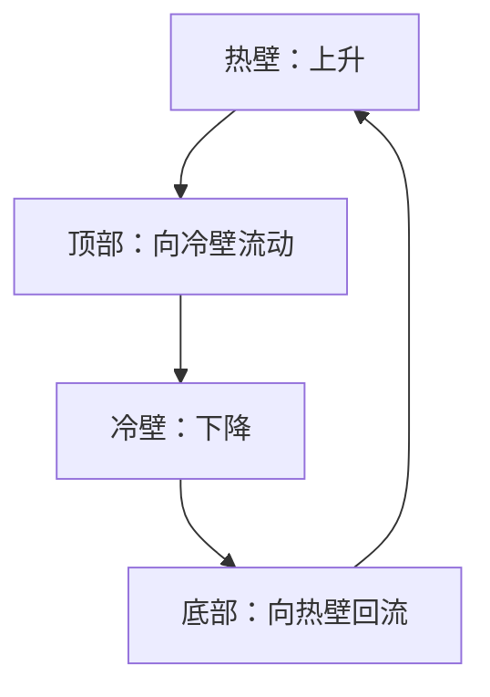

# 习题 5-4：方腔自然对流

左壁热、右壁冷、上下壁绝热时，热流体沿左壁上升，在上部向右流动；沿右壁冷却下沉，再从底部返回左壁，形成顺时针主循环。壁面速度为零，循环是腔内流体运动。左壁附近温度最高，右壁附近最低；等温线随对流弯曲。

低 Rayleigh 数时导热占主导，等温线接近竖直直线；Rayleigh 数增加后，两竖壁的热边界层变薄，内部温度更趋均匀。没有尺寸、温差和物性时，不能确定流动是否湍流或画出定量等温线。

