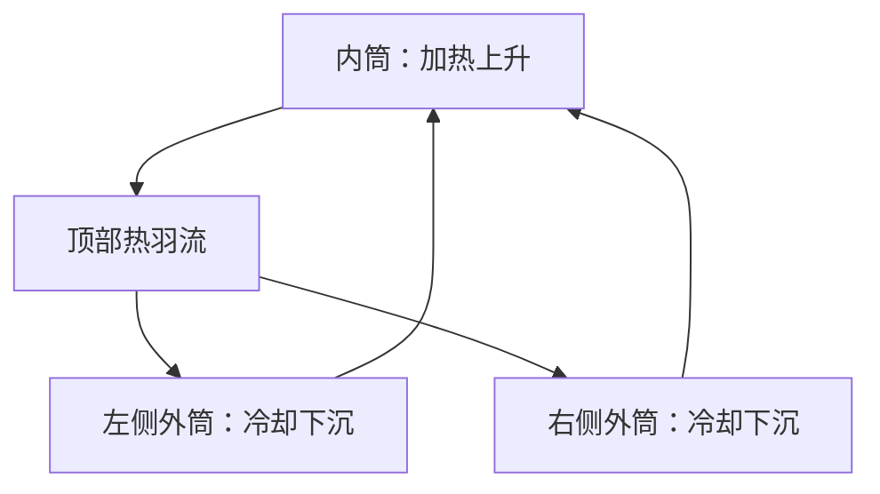

# 习题 5-5：水平同心圆筒夹层

内筒较热、外筒较冷时，流体从内筒两侧受热上升，在内筒上方汇合形成上升热羽流；在外筒附近冷却下沉，形成左右两个方向相反的循环。小间隙或弱浮升力情况下，对流受抑制，传热接近导热。

从热源到外界的路径依次为内筒壁导热、夹层内导热和自然对流、外筒壁导热、外表面对流。内外筒之间及外筒与环境之间还可能存在辐射；辐射与相应对流路径并联，不能将辐射热阻简单串入对流热阻。定量判断需给出筒径、温差、流体和表面发射率。

