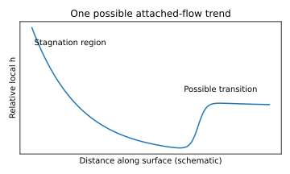

# 习题 5-6：钝头物体表面换热

迎风驻点附近外流发生强烈加速，热边界层较薄，局部换热系数通常较高。驻点流动需采用驻点关联式，其局部换热系数有限；不能把平板 h_x∝x^(-1/2) 外推到驻点并得出无限大。

沿表面离开驻点，边界层发展常使换热系数降低。后续转捩、逆压梯度与分离会改变这一趋势，转捩可能增强换热，分离区则可能降低换热。在光滑表面、低来流扰动的典型情形下，驻点附近常为层流，沿表面发展后才可能转捩；具体位置需结合 Reynolds 数与来流扰动。

